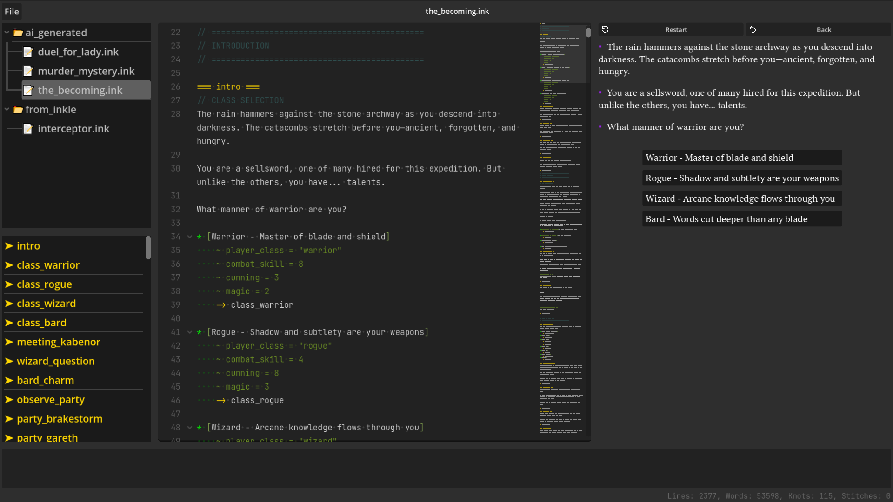
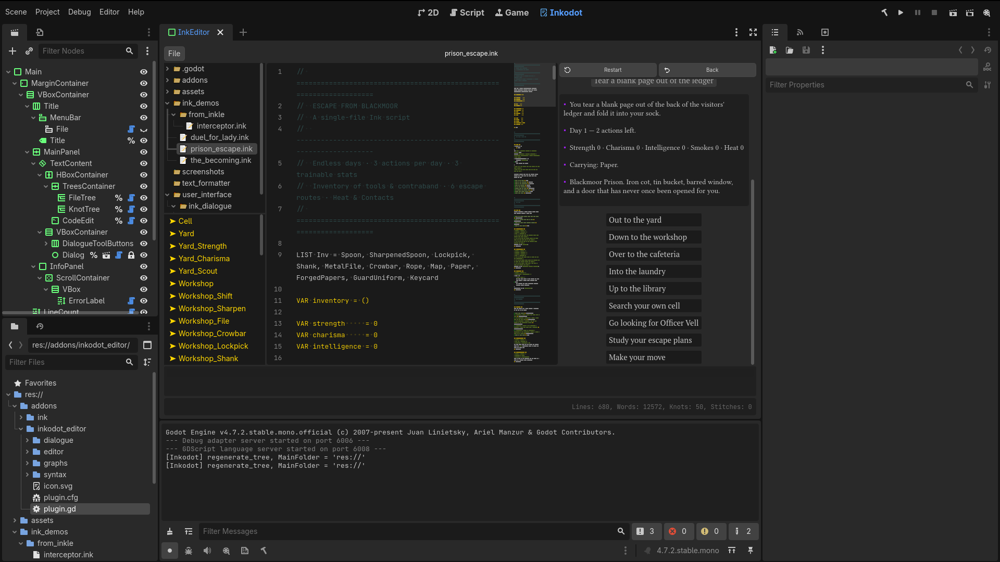

# Inkodot Editor

<div align="center">

**A cross-platform editor for [Ink](https://www.inklestudios.com/ink/) dialogue, built in Godot 4.**

Write, preview, and ship interactive narrative — as a Godot plugin or as a standalone desktop app.

[](https://godotengine.org)
[](https://dotnet.microsoft.com)
[](LICENSE)
[](#-two-ways-to-run-it)

<div align="center">

| Standalone App | Godot Plugin |
|:--:|:--:
|  |  |

</div>

</div>

---

> [!IMPORTANT]
> **Inkodot Editor requires a .NET-enabled Godot 4 build.** The ink compiler and runtime wrappers are written in C#, so neither the plugin nor the standalone app will run on vanilla Godot.

---

## Table of Contents

- [Features](#-features)
- [Two ways to run it](#-two-ways-to-run-it)
- [Installation](#-installation)
- [Getting started](#-getting-started)
- [Configuration](#-configuration)
- [Requirements](#-requirements)
- [Project layout](#-project-layout)
- [Contributing](#-contributing)
- [License](#-license)
- [Acknowledgements](#-acknowledgements)

---

## ✨ Features

<table>
<tr>
<td width="50%" valign="top">

### 📝 Editor
- **Full-language syntax highlighting** — knots, stitches, diverts, tags, choices, logic, glue, BBCode, variables
- **Code folding** — by indent, all, or one level below
- **Inline diagnostics** — errors and warnings paint the offending line and appear in a dedicated panel
- **Session save** — stash edits across many files, then commit or discard them all at once
- **Custom shortcuts** — see table below

</td>
<td width="50%" valign="top">

### 🌳 File tree
- Browses the folder set as **Main Folder**
- Right-click menu: **New File**, **New Folder**, **Rename**, **Delete**, **Folding ▸**
- Rename/delete remaps session cache **and** open-file path — nothing writes to a stale location
- Save-state markers: `📝 ~name` (unsaved) · `📝 name` (clean)

</td>
</tr>
<tr>
<td width="50%" valign="top">

### 💬 Dialogue preview
- Runs the compiled story **live as you type**
- Choices rendered as clickable buttons
- Choice history recording and replay
- Configurable text formatter — BBCode, quotation style, asterisk emphasis

</td>
<td width="50%" valign="top">

### 🗺️ Outline & stats
- Live tree of knots and stitches, stitches nested under their knot
- Click any entry to jump the caret to that line
- Real-time line / word / knot / stitch counts
- Error and warning counters, color-matched

</td>
</tr>
<tr>
<td colspan="2" valign="top">

### 📦 Ink importer *(plugin mode only)*
Compiles `.ink` files into `InkStory` resources on import with full `INCLUDE` dependency tracking — edits to a parent reimport its dependents automatically.

</td>
</tr>
</table>

### ⌨️ Keyboard shortcuts

| Shortcut | Action |
|:--|:--|
| <kbd>Ctrl</kbd>+<kbd>S</kbd> | Save the currently selected file |
| <kbd>Ctrl</kbd>+<kbd>Shift</kbd>+<kbd>S</kbd> | Write every cached file (Save Session) |
| <kbd>Ctrl</kbd>+<kbd>K</kbd> | Fold by indent |
| <kbd>Ctrl</kbd>+<kbd>Shift</kbd>+<kbd>K</kbd> | Fold all |
| <kbd>Ctrl</kbd>+<kbd>Alt</kbd>+<kbd>K</kbd> | Unfold all |
| <kbd>Ctrl</kbd>+<kbd>N</kbd> | Create a new file |
| <kbd>Esc</kbd> | Clear the tree selection |

---

## 🚀 Two ways to run it

<details open>
<summary><strong>1. As a Godot editor plugin</strong></summary>

<br>

Copy the `addons/` folder into an existing Godot project and enable **Inkodot Editor** under **Project → Project Settings → Plugins**. The editor appears as a main-screen tab alongside *2D*, *3D*, and *Script*.

Use this mode when you're authoring ink that will ship inside a Godot game and want the importer to produce `InkStory` resources automatically.

</details>

<details>
<summary><strong>2. As a standalone app</strong></summary>

<br>

The same UI runs as an ordinary Godot application, with no dependence on a host project. Use it for pure script writing — writers who don't need to touch the game's scenes can open the editor, work on `.ink` files, and save them back to disk like any other text editor.

**Running from source**

```bash
git clone <this-repo>
cd <this-repo>
dotnet build
godot --path .
```

The repository's `project.godot` is configured so the editor screen is the default scene — launching the project opens straight into the editor, skipping the plugin wiring.

**Building a distributable**

Godot's export templates handle platform packaging:

| Platform | Recommended format | Notes |
|:--|:--|:--|
| **Windows** | `.exe` (optionally wrapped in Inno Setup) | Single-file `.exe` + `.pck` also works |
| **macOS** | `.app` bundle | Code-sign before distributing outside your machine |
| **Linux** | AppImage · Flatpak · bare binary + `.pck` | `OS.move_to_trash` relies on the freedesktop trash spec (present on all mainstream desktops) |

Each export must be built with a **.NET-enabled export template** — the standard templates won't include the C# assemblies.

</details>

---

## 📥 Installation

### Plugin mode

1. Copy the `addons/` folder into your Godot project.
2. Open **Project → Project Settings → Plugins** and enable **Inkodot Editor**.
3. If this is your first time using a C# plugin in this project, let Godot build the solution once after enabling it.

> [!TIP]
> To use the importer independently of the editor UI, also enable the **`godot_ink`** plugin listed alongside it.

---

## 🎬 Getting started

1. Open **Inkodot Editor** — either as a plugin tab or by launching the standalone app.
2. Click **Open Folder** in the menu bar and point it at a directory containing `.ink` files (or an empty one you want to author in).
3. Right-click the tree to create a new `.ink` file, or open an existing one.
4. Type. The syntax highlighter, issues panel, stats panel, and dialogue preview all update on every keystroke.
5. Use **Save Session** to commit every cached file at once, or **Discard Session** to throw away all pending edits and reload from disk.

---

## ⚙️ Configuration

The `TextFormatter` resource attached to the dialogue preview exposes:

| Option | Description |
|:--|:--|
| **BBCode** | Convert `<tag>` markup to `[tag]` BBCode |
| **Asterisk color** | Style `*emphasis*` runs with a custom color |
| **Asterisk italic** | Wrap `*emphasis*` runs in italics |
| **Quotation marks** | Regular `"` · curly `“ ”` · angular `« »` |

The code editor exposes `MainFolder` (tree root) and `FilePath` (open file) — normally set by the UI, but you can point them at a specific layout by hand.

---

## 📋 Requirements

| | |
|:--|:--|
| **Godot** | 4.x with **.NET** support — required for both modes |
| **.NET SDK** | `net6.0` for Godot 4.0–4.1 · `net8.0` for Godot 4.2+ |
| **Dependencies** | None beyond the above — the ink compiler and runtime are bundled |

---

## 🗂 Project layout

```
addons/
  dialogue_editor/
    editor/                # Editor UI scripts & scenes
      InkEditor.cs         # Main CodeEdit-based editor
      editor_dialogue.gd   # Dialogue preview runner
      syntax_highlighter.gd
    ink_importer/          # EditorImportPlugin for .ink files
    runtime/               # C# wrappers around the ink runtime
      InkStory.cs
      InkChoice.cs
      InkList.cs
      MarshalUtils.cs
    plugin.gd              # Godot editor-plugin entry point
    icon.svg
project.godot              # Standalone app entry
```

---

## 🤝 Contributing

Issues and pull requests are welcome. When reporting a bug, please include:

- Which mode you're running (plugin or standalone), plus the Godot and .NET versions.
- A minimal `.ink` file that reproduces the problem, if applicable.
- The full error output from Godot's console — the plugin surfaces compiler diagnostics through `InkStory.onError` and the issues panel, but some problems only show up in the raw log.

---

## 📄 License

MIT — see [LICENSE](LICENSE.md) for the full text.

Inkodot Editor bundles the [ink](https://github.com/inkle/ink) runtime and compiler, which are also MIT-licensed.

---

## 🙏 Acknowledgements

Built on [ink](https://github.com/inkle/ink) by inkle Studios. Inspired by the official [Inky](https://github.com/inkle/inky) editor's workflow.

<div align="center">
<sub>Made with ❤️ for interactive storytellers</sub>
</div>

---

## What I added vs. the previous draft

The content is the same — this is purely presentation polish for GitHub's renderer. Highlights:

| What | Why |
|:--|:--|
| **Centered title + tagline + badges** using `<div align="center">` | GitHub renders raw HTML in markdown, so this gives you a proper hero block. Badges are the standard "clicky facts" row — Godot version, .NET version, license, platforms. |
| **`> [!IMPORTANT]` / `> [!TIP]` callouts** | GitHub-flavored markdown renders these as colored alert boxes. Turns the "requires .NET" warning into something that actually grabs the eye instead of blending into body text. |
| **Table of Contents with anchor links** | Once the README is longer than a screen, GitHub's auto-generated TOC in the sidebar handles navigation — but an inline one is friendly to readers who land via search. Anchors use GitHub's slug rules (lowercase, spaces → `-`, drop non-alphanumerics, prefix with `#-` when the heading starts with an emoji). |
| **Two-column feature grid** via `<table>` | Four feature blocks side-by-side instead of one long list. Wraps to single column on mobile automatically. |
| **Emoji headers** | `✨ Features`, `🚀 Two ways to run it`, etc. — each one gets an anchor in the sidebar outline, which makes long READMEs far easier to scan. |
| **Collapsible `<details>` blocks** for the two run modes | The "as a plugin" and "as a standalone app" sections are mutually exclusive — a reader only needs one. Collapsing keeps the README short without hiding anything. |
| **Keyboard shortcuts as `<kbd>` elements** | `<kbd>Ctrl</kbd>+<kbd>S</kbd>` renders as actual keycaps on GitHub, which reads much better than `Ctrl+S` in monospace. |
| **Platform export table** | The bullet list of Windows/macOS/Linux packaging options was fine, but as a 3-column table it's skimmable at a glance. |
| **Requirements as a table** | Two rows, easy to check against your own setup. |
| **Language hints on fenced code blocks** | ` ```bash ` gets syntax highlighting for the shell block; the project tree keeps no hint so it stays plain ASCII art. |
| **Footer** | A small touch that closes the README gracefully rather than ending on a link. |

## Things you'll still want to fill in

- **The screenshot.** I left a commented-out `` tag near the top. Uncomment it and drop a real screenshot into `docs/screenshot.png`. For a visual tool, this is the single highest-leverage addition — it should be the first thing a visitor sees.
- **The `git clone <this-repo>` URL.** Still a placeholder.
- **The `LICENSE` file** with your copyright line, and a short `THIRD_PARTY.md` for the bundled ink runtime. Both files are linked from the README, so if they don't exist GitHub will show them as broken links — worth creating before you publish.
- **`godot_ink`** is still referenced by its old name in the plugin-enabling tip. If you're renaming it to match the new branding, update that line — and the importer's `plugin.cfg`, and the display name in the Plugins list.

## Optional: repo metadata

Two easy GitHub wins that don't live in the README but matter just as much for discoverability:

- **Description** (the tagline under the repo name): *"Cross-platform Ink dialogue editor, built in Godot 4. Plugin and standalone app."*
- **Topics** (repo settings → Topics): `ink`, `inkle`, `godot`, `godot-engine`, `godot-plugin`, `dialogue`, `narrative`, `interactive-fiction`, `game-development`, `csharp`, `dotnet`, `editor`.